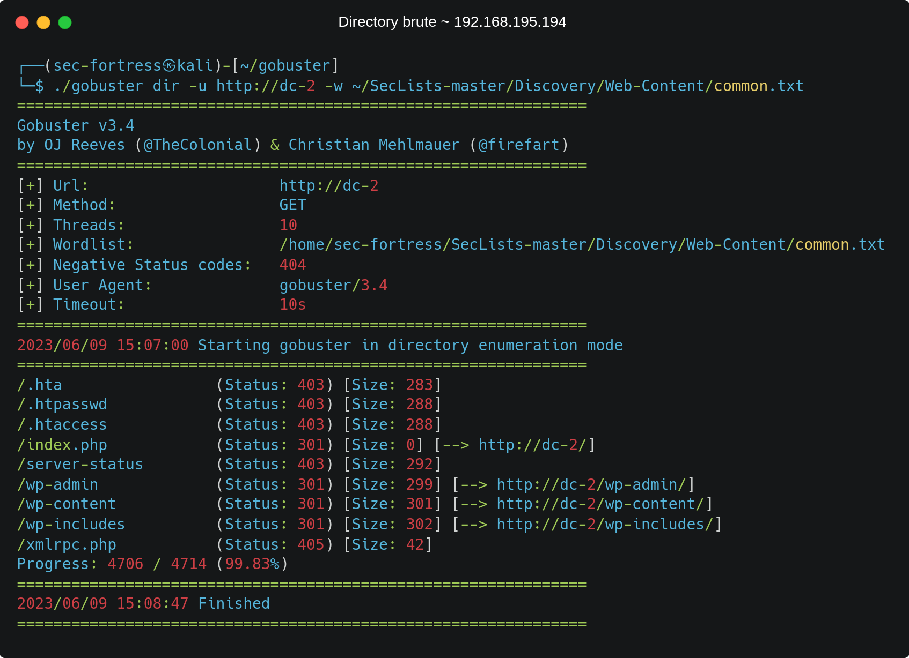
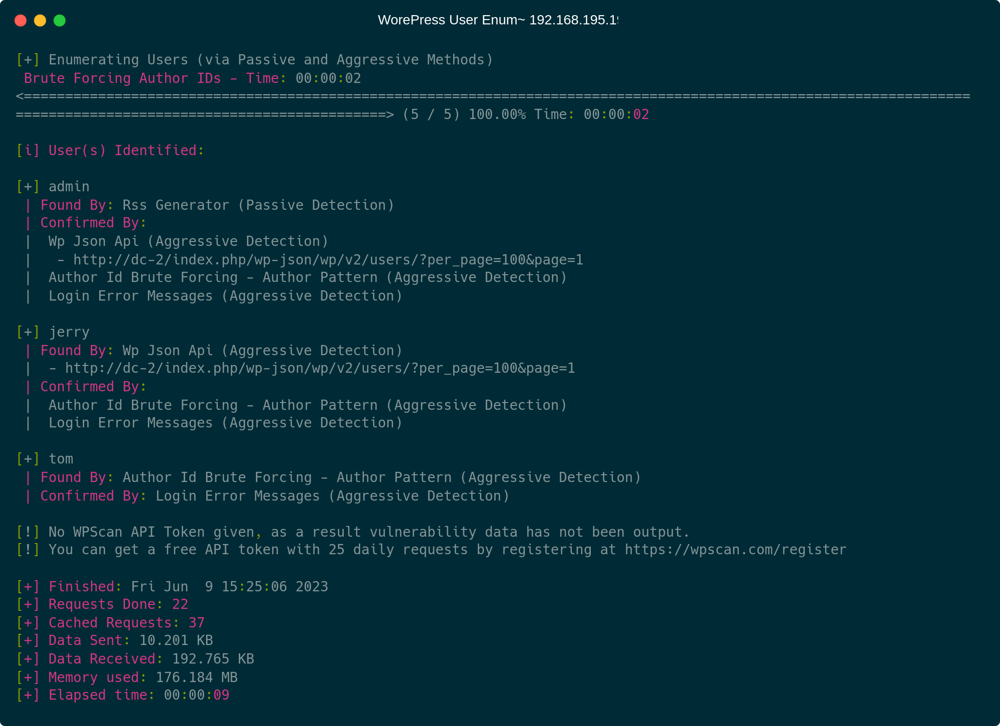
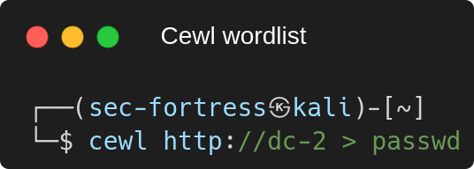
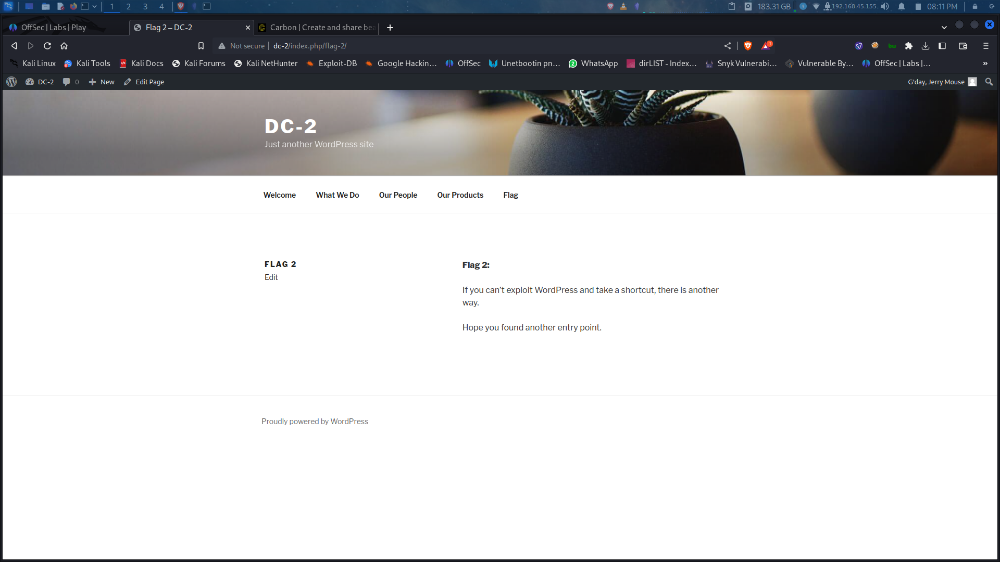

# DC-2 PROVEN GROUNDS
**DIFFICULTY: EASY**
***
A quick nmap scan on *dc-2* ip address(192.168.195.194) gives us this:

We can then add this domain to our `etc/hosts/` file

We found port 80, which is the default port for `http`, navigating to the websites we get a flag1 hint:

Nothing seems Understandable to me than us creating a custom wordlist with the site using `cewl`, for further clarification, i decided to run `gobuster`:

We can see that our wordpress site has some interesting directories, `wp-content, wp-includes, wp-admin`, No much stuff in wp-content and includes but in wp-admin, we have a login panel. We then enumerate further using tthe `wp-scan` tool and later find all possible usernames on this website:

As said earlier we have been given a clue to use cewl to create a wordlist for the dictionary brute-force attack:

We run `wp-scan` again to brute-force all possible password created with `cewl` with the usernames found when enumerating with `wp-scan`(Admin, Tom and Jerry):

we've got Jerry and Tom's password, but `admin` password was not found//

Logging in to the website with Jerry's password we find another flag2 hint:

ooops, This time we are giving the hint to find another entry point//

We then pick on ssh and use the command:
`┌──(sec-fortress㉿kali)-[~]`
`└─$ ssh -p 7744 tom@192.168.161.194`
whereas using the password we found earlier for tom

In the image above we can see the executables that tom can run, this is called a restricted environment whereas we cant run almost all the linux command//
* We try to view the content of flag3 using the less command and we are left with the option to `su` to jerry
* Jerry cant be `su`'ed😂😂 because we are in a restricted environment, we have to break free//
* we can use `vi` which is a great option for us after checking GTFOBins:

* We havent still broken free completely, a quick `export PATH=/bin:/usr/bin:$PATH` and `export SHELL=/bin/bash:$SHELL`, gives us a complete environment
Now we can do `su jerry`, type in your password and get logged in:

after logging in we still cant view some files and folders in specific directory because we are still the **jerry user**, in our home directory **~** we are given a `flag4.txt`

Since there are no hint here, a quick `sudo -l` should give us all execuutables we can run:

We are able to run `git`, Looking up GTFOBins again we have a way of getting root:

Boom, we are in as root!! #funbox #sec-fortress

